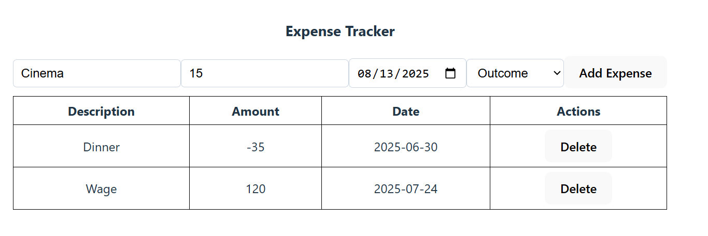

# Expense Tracker Assignment

Create a simple Expense Tracker built with React, TypeScript, and Vite.

## Features
- Add expenses with description, amount, type (income/outcome), and date
- Validation to ensure all fields are filled and the amount is a valid number
- View a list of all expenses in a table
- Delete expenses
- Type-safe code using TypeScript

**Note:** If the selected type is **outcome**, the amount should be saved as a negative value.

## Usage
1. Enter a description, amount, date, and select the type (income or outcome).
2. Click **Add Expense** to add it to the table.
3. View all expenses in the table below. Use the **Delete** button to remove an expense.

## Bonus
- Display the current saldo (total balance) on the page, calculated as the sum of all expense amounts.
- Monthly limit and alert.

