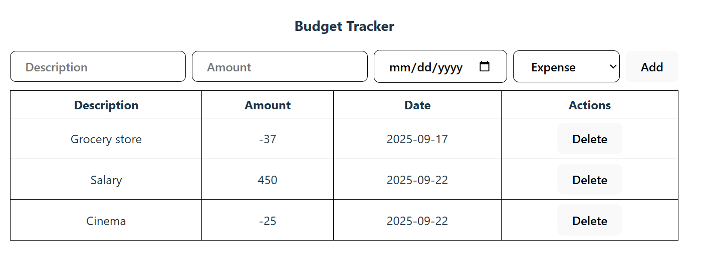
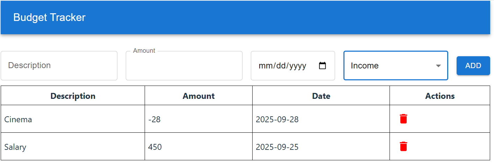
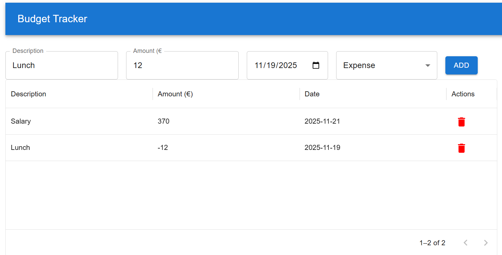

# Budget Tracker Assignment

Create a simple Budget Tracker built with React and TypeScript.
## Step 1
Step one can be started after the TodoList is implemented in the course

### Features
- Add budget items with description, amount, type (income/expense), and date
- Validation to ensure all fields are filled and the amount is a valid number
- View a list of all expenses in a table
- Delete budget items from a table
- Type-safe code using TypeScript

**Note:** If the selected type is **expense**, the amount should be saved as a negative value.

### Usage
1. Enter a description, amount, date, and select the type (income or expense).
2. Click **Add** to add it to the table.
3. View all budget items in the table below. Use the **Delete** button to remove an expense.

### Bonus
- Display the current saldo (total balance) on the page, calculated as the sum of all budget item amounts.
- Monthly limit and alert.

## Step 2: Material UI
Step two can be started after the Material UI is studied in the course. In this phase you'll enhance the Expense Tracker by using the Materia UI components.

**Material UI component:**
- Create an app bar for the application that show the header text Budget Tracker
- Replace the `input` and `button` elements in the Expense Tracker with suitable Material UI components.
- Input elements and button should be horizontally aligned and add proper spacing and margins between each component to ensure user-friendly ui.

**Date Picker:**
- Replace the current date input field in the Expense Tracker with the MUI-X Date Picker (https://mui.com/x/react-date-pickers/date-picker/).
- In the table where expense entries are listed, format the displayed date in format `yyyy-mm-dd`.

## Step 3: Datagrid
This step can be started after the MUI-X DataGrid is studied in the course. In this step, you will upgrade the budget item list display by replacing the basic HTML table with the MUI-X `DataGrid` component for improved functionality.
Remove the existing HTML table used to display budget item entries.

- Implement the MUI-X `DataGrid` component to present the data instead.
- Configure appropriate columns, such as Title, Amount, Date, and any other relevant fields.
- Enable useful features like sorting, filtering, and pagination for better user experience.

### Bonus
- Show the amount in 🔴 red color for expense items and 🟢 green color for income items.
- Organize the DataGrid rows by type, grouping items into income and expense categories.

## Step 4: Routing
This step can be started after the React Router is studied in the course.

First, add React Router to your project

Implement two new components:
- `Home`: Displays a welcome message to users.
- `Statistics`: Shows the total income, total expenses, and the saldo.

Finally, implement navigation and routing between them

### Tips
If you notice that your expenses and incomes disappear when navigating between pages, it's likely because the data is stored in a component that gets unmounted when the route changes. Then, when it's mounted again, a new instance of the state is created.

To fix this, try lifting the state up:
Move the state that holds your budget to a higher-level component such as `App` so it stays in memory while switching between pages. Then, pass it down as props to the components that need it.

You can read more about lifting state up in [React doucmentation](https://react.dev/learn/sharing-state-between-components)

